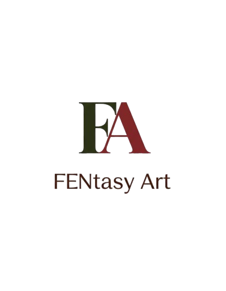

<div align="center">

  
  
  <h1>🎨 FENtasyArt</h1>
  
  <h3>Creative Space & Workshop Management Platform</h3>
  
  <p>
    <i>"Where Creativity Meets Opportunity"</i>
  </p>

  <p>
    <a href="https://github.com/lmmanuela/fentasyart">
      
    </a>
    <a href="#-tech-stack">
      
    </a>
    <a href="#-tech-stack">
      
    </a>
     <a href="#-license">
      
    </a>
  </p>

  <p>
    <a href="#-tentang-proyek">About</a> •
    <a href="#-fitur-unggulan">Features</a> •
    <a href="#-struktur-proyek">Structure</a> •
    <a href="#-instalasi--penggunaan">Installation</a>
  </p>
</div>

---

## 📖 Tentang Proyek

**FENtasyArt** adalah platform manajemen berbasis web yang dirancang khusus untuk memfasilitasi seniman dan kreator. Aplikasi ini menjembatani kebutuhan ruang kreatif (*creative space*) dan akses pendidikan seni (*workshops*) dalam satu ekosistem digital yang terintegrasi.

Proyek ini dibangun untuk menyelesaikan masalah **fragmentasi informasi** jadwal seni dan **inefisiensi pemesanan manual** yang sering terjadi di komunitas kreatif.

---

## 🛠 Tech Stack

Sistem dibangun dengan pendekatan *Native PHP* yang terstruktur (separation of concerns) untuk memastikan performa ringan dan kemudahan maintenance.

| Komponen | Teknologi | Deskripsi |
| :--- | :--- | :--- |
| **Backend Logic** | PHP Native | Menggunakan folder `handlers/` untuk memproses logika form. |
| **Database** | MySQL | Penyimpanan data relasional untuk user, booking, dan workshop. |
| **Frontend** | HTML5, CSS3 | Styling custom (`style.css`) dipadukan dengan layout responsif. |
| **Interactivity** | JavaScript | Validasi sisi klien dan interaksi UI (`script.js`). |
| **Assets** | PNG, ICO | Manajemen aset gambar yang terpusat. |

---

## ✨ Fitur Unggulan

1.  🗓️ **Smart Booking System**
    Pemesanan ruang kreatif dengan validasi ketersediaan otomatis yang diproses melalui `booking_handler.php`.
2.  🎨 **Workshop Discovery**
    Katalog interaktif untuk menemukan dan mendaftar workshop seni terbaru.
3.  🛡️ **Secure Authentication**
    Sistem Login & Register aman dengan hashing password dan session management (`login_handler.php`, `register_handler.php`).
4.  💼 **Admin Dashboard**
    Halaman khusus (`admin_dashboard.php`) untuk pengelola memantau reservasi dan pembayaran.
5.  💳 **Payment Validation**
    Alur konfirmasi pembayaran yang sistematis untuk memastikan transaksi valid.

---

## 📂 Struktur Proyek

Berikut adalah struktur direktori source code berdasarkan implementasi saat ini:

```text
fentasyart/
├── assets/                 # File statis dan media
│   ├── uploads/            # Direktori penyimpanan bukti bayar/gambar user
│   ├── logo.ico            # Favicon website
│   ├── logo.png            # Logo utama
│   ├── script.js           # Logika Frontend (DOM Manipulation)
│   └── style.css           # Custom Styling
│
├── config/
│   └── db.php              # Konfigurasi koneksi database (MySQLi/PDO)
│
├── handlers/               # Logic Processor (Backend Actions)
│   ├── admin_handler.php   # Logika khusus admin
│   ├── booking_handler.php # Proses input pemesanan
│   ├── contact_handler.php # Form contact processing
│   ├── login_handler.php   # Autentikasi masuk
│   ├── logout.php          # Destruksi sesi
│   ├── payment_handler.php # Validasi pembayaran
│   └── register_handler.php# Pendaftaran user baru
│
├── includes/               # Komponen UI Reusable (Partials)
│   ├── footer.php          # Bagian bawah halaman
│   ├── head.php            # Meta tag & library links
│   └── header.php          # Navigasi bar
│
├── about.php               # Halaman Tentan Kami
├── admin_dashboard.php     # Halaman Utama Admin
├── contact.php             # Halaman Kontak
├── index.php               # Landing Page (Homepage)
├── login.php               # Halaman Masuk
├── payment.php             # Halaman Pembayaran
├── profile.php             # Halaman Profil User
└── register.php            # Halaman Pendaftaran

```

---

## 🚀 Instalasi & Penggunaan

Ikuti langkah ini untuk menjalankan proyek di komputer lokal (Localhost):

### 1. Clone Repository

Buka terminal atau Git Bash, lalu arahkan ke folder `htdocs` (jika menggunakan XAMPP).

```bash
cd C:/xampp/htdocs
git clone [https://github.com/lmmanuela/fentasyart.git](https://github.com/lmmanuela/fentasyart.git)

```

### 2. Setup Database

1. Aktifkan **Apache** dan **MySQL** di XAMPP.
2. Buka `http://localhost/phpmyadmin`.
3. Buat database baru bernama `fentasyart_db` (atau sesuaikan dengan nama di file config).
4. Import file database (jika ada file `.sql` yang disediakan terpisah, atau buat tabel sesuai entitas proyek).

### 3. Konfigurasi Koneksi

Buka file `config/db.php` dan sesuaikan kredensial database Anda:

```php
// config/db.php
$hostname = "localhost";
$username = "root";
$password = "";
$database = "fentasyart_db"; // Sesuaikan nama DB

```

### 4. Jalankan Aplikasi

Buka browser favorit Anda dan akses:
`http://localhost/fentasyart`

---

## 👥 Tim Pengembang

Project ini dikembangkan untuk memenuhi tugas **Ujian Akhir Semester (UAS)**.

* **[Nama Kamu]** - *Lead Developer*
* **[Nama Anggota Tim]** - *UI/UX Designer*
* **[Nama Anggota Tim]** - *Database Engineer*

---

<div align="center">
<small>Copyright © 2025 FENtasyArt. All Rights Reserved.</small>
</div>

